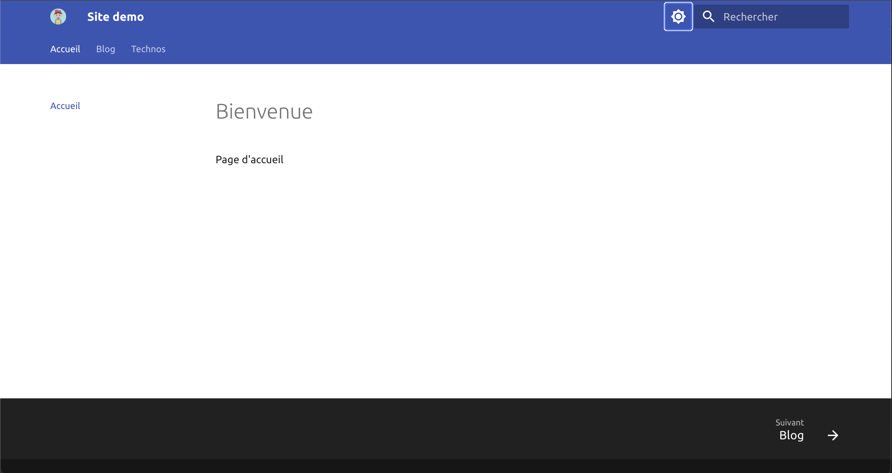
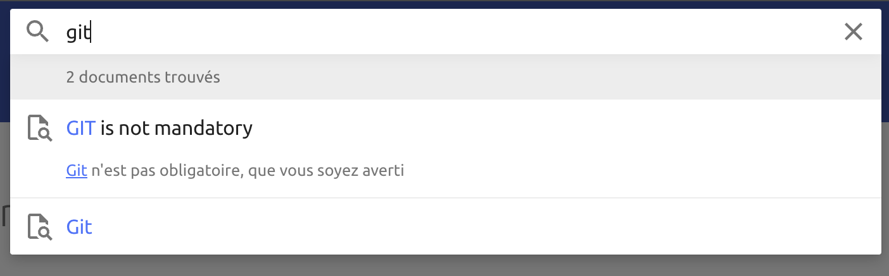
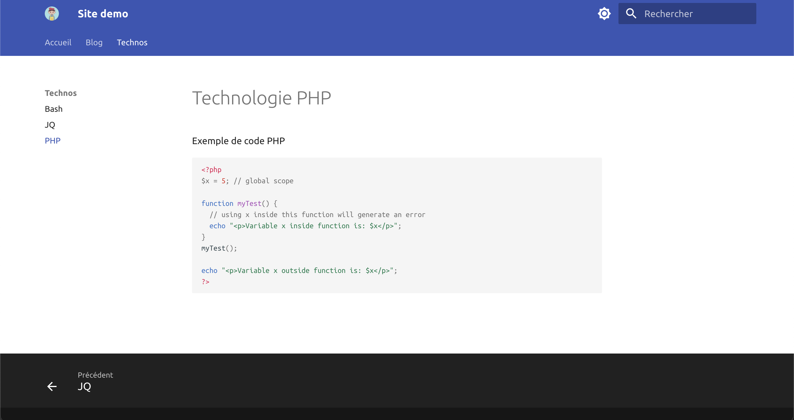
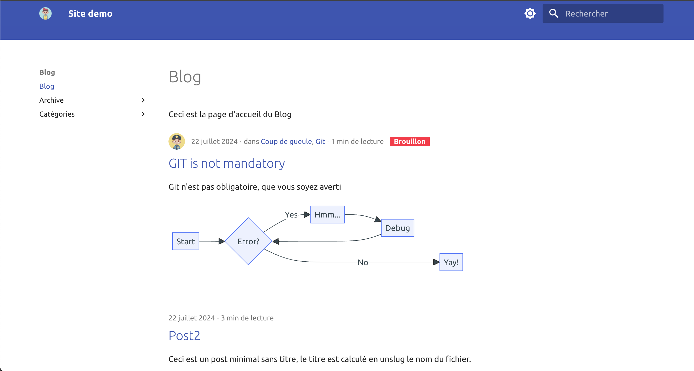
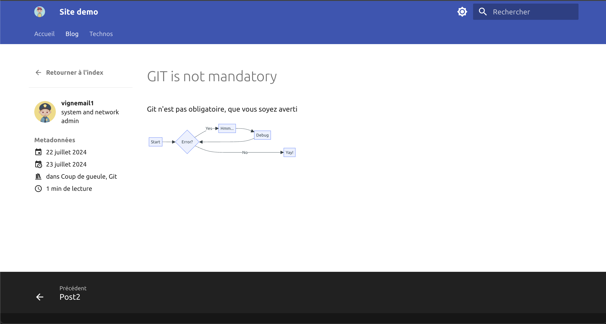

# Base d'un site material for mkdocs







Material for Mkdocs : <https://squidfunk.github.io/mkdocs-material/getting-started/>

Plugins built-in activés :

- blog # moteur de blog, recherche par défaut /blog
- search # recherche en JS
- offline # permet de télécharger tous les ressources extérieures et avoir tout les ressources en local

Extensions ajoutées :

- mkdocs-mermaid-plugin (faire des diagrammes en langage GraphViz)
- mkdocs-awesome-pages-plugin (<https://github.com/lukasgeiter/mkdocs-awesome-pages-plugin> ; pour gérer différents aspects comme la navigation personnalisée)

## Bare-metal

### Installation

```bash
git clone https://github.com/vignemail1/mkdocs-demo.git
cd mkdocs-demo
python3 -m venv ../mkdocs-demo-venv
source ../mkdocs-demo-venv/bin/activate
pip install -r requirements.txt
export PATH=$PWD/../mkdocs-demo-venv/bin:$PATH
```

### Visualiser le site en mode liveserver

```bash
mkdocs serve
# le site sera alors en liveserver par défaut sur http://127.0.0.1:8000
```

### Construire le site

Par défaut, le site sera construit dans le sous-dossier `site` du projet.
Voir les options de la commande `mkdocs` pour plus d'infos et options.

```bash
mkdocs build
```

## mode Docker

### Lancer en mode liveserver

Un `Dockerfile` et un `docker-compose.yml` sont mis à disposition afin de lancer le tout sans pourrir son ordinateur avec des dépendances.

Pour lancer le tout :

```bash
docker compose up -d
```

Le site sera alors disponible à l'URL <http://0.0.0.0:8000>

### Builder

```bash
docker run --rm -it -v $PWD:/docs mkdocs build
```
